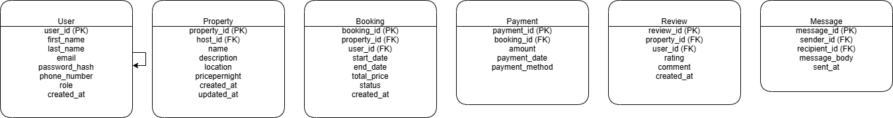

# Airbnb Clone – Backend Features & Functionalities

This document outlines the key backend features and functionalities required for the Airbnb Clone project, based on the ALX Software Engineering program specifications.

##  Key Functional Areas

The backend supports the following modules:

### 1. User Management
- Secure registration for Guests and Hosts
- JWT-based authentication and OAuth login
- Profile management

### 2. Property Listings
- Hosts can add, edit, and delete properties
- Listings include title, description, location, price, and availability

### 3. Search and Filtering
- Users can search properties by location, price range, number of guests, and amenities
- Includes pagination for efficiency

### 4. Booking System
- Guests can book available properties
- Date validation to prevent double booking
- Booking status tracking (pending, confirmed, cancelled)

### 5. Payment Integration
- Payments handled via Stripe/PayPal
- Support for multiple currencies
- Hosts receive payouts automatically

### 6. Reviews and Ratings
- Verified reviews from guests
- Hosts can respond
- Reviews linked to completed bookings

### 7. Notification System
- In-app and email notifications for key events (booking, cancellations, payments)

### 8. Admin Dashboard
- Admins can monitor and manage users, listings, bookings, and payments

##  Technical Highlights
- **Database:** PostgreSQL/MySQL
- **APIs:** RESTful (with optional GraphQL)
- **Auth:** JWT, RBAC
- **Storage:** Cloud-based file storage for images
- **Error Handling:** Centralized error logging
- **Performance:** Redis caching, optimized queries
- **Testing:** Unit & integration testing with Pytest

##  Diagram
The diagram below illustrates the major backend components and their interactions:

