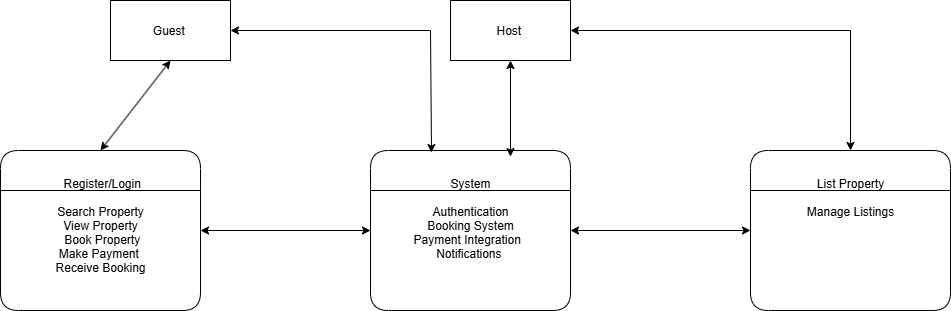

# Use Case Diagram – ALX Airbnb Clone Project

##  Objective

This diagram visualizes the interactions between users and the Airbnb Clone system, focusing on key features and functionalities such as:

- User Registration and Login
- Property Search and Viewing
- Property Booking
- Payments
- Listing and Managing Properties

##  Actors

- **Guest**: A user who browses, books, and pays for properties.
- **Host**: A user who lists and manages properties on the platform.
- **System**: The backend system that handles user interactions, data processing, and responses.

##  Use Cases

The diagram illustrates the following use cases:

- **Register/Login**: Users can create an account or log in to access features.
- **Search Property**: Guests can search for available properties.
- **View Property Details**: Guests can view specific information about a property.
- **Book Property**: Guests can reserve a property for specific dates.
- **Make Payment**: Guests complete the booking by making a payment.
- **Receive Booking Confirmation**: Guests receive confirmation after successful booking.
- **List Property**: Hosts can add new properties to the platform.
- **Manage Listings**: Hosts can edit or remove their listings.

##  File Included

- `use-case.png`: A graphical representation of the system's use case diagram.

##  Diagram Preview

##  Location in Repository

This file and the diagram image are located in the following path:

